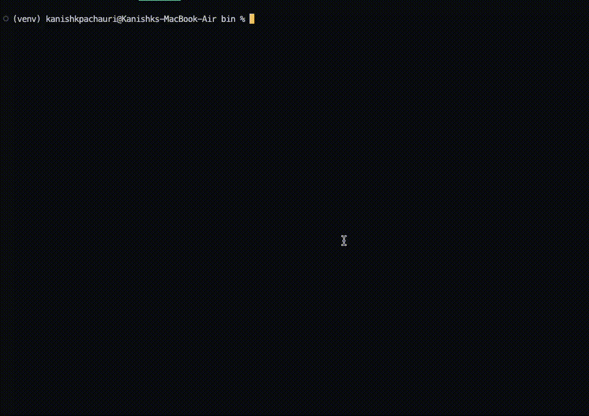

# bitssh

[](https://github.com/Mr-Sunglasses/bitssh)
[](https://github.com/Mr-Sunglasses/bitssh/network)
[](https://github.com/Mr-Sunglasses/bitssh)
[](https://github.com/Mr-Sunglasses/bitssh/blob/main/LICENSE)
[](https://github.com/ellerbrock/open-source-badges/) [](http://makeapullrequest.com)  

A New and Modern SSH connector written in Python.

Terminal user interface for SSH. It uses `~/.ssh/config` to list and connect to hosts.

<p align="center">
    
</p>

## Demo

[]

## Installation

Install bitssh with pip

```bash
  pip3 install bitssh

  bitssh
```

Install from source

```bash
  git clone https://github.com/Mr-Sunglasses/bitssh

  cd bitssh

  python3 -m pip3 install .

  bitssh
```

# Troubleshooting

## [...]/.ssh/config: no such file or directory

- Check if you have `~/.ssh/config` file
- If you don't, create it with `touch ~/.ssh/config`

Here's a sample `~/.ssh/config` file that is recognized by bitssh:

```bash
Host abc
	Hostname xxx.xx.xx.xx
	User test1
	port 22

Host pqr
	Hostname ec2-xxx-xxx-xxx-xxx.compute-1.amazonaws.com
	User ubuntu
	port 22

Host wxy
	Hostname xxx.xx.xxx.xx
	User test2
	port 22
```

You can check the [OpenBSD `ssh_config` reference](https://man.openbsd.org/ssh_config.5) for more information on how to setup `~/.ssh/config`.

## Documentation

[Documentation](docs/docs.md)

## Contributing

Contributions are always welcome!

See `contributing.md` for ways to get started.

Please adhere to this project's `code of conduct`.

## Authors

- [@Mr-Sunglasses](https://www.github.com/Mr-Sunglasses)

## License

[MIT](https://choosealicense.com/licenses/mit/)

## 💪 Thanks to all Wonderful Contributors

Thanks a lot for spending your time helping AutoType grow.
Thanks a lot! Keep rocking 🍻

[](https://github.com/Mr-Sunglasses/bitssh/graphs/contributors)

## 🙏 Support++

This project needs your shiny star ⭐.
Don't forget to leave a star ⭐️

[](https://www.python.org/) [](https://forthebadge.com)
